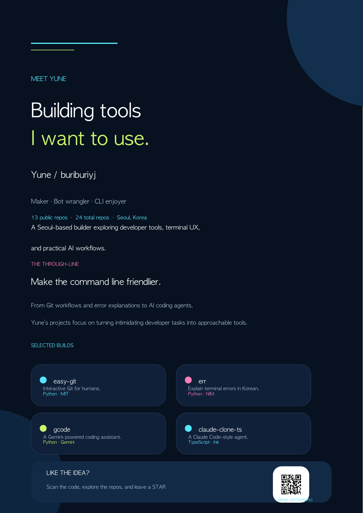

# Yune · buriburiyj

**Maker · Bot wrangler · CLI enjoyer**

Building tools I want to use.

### Explore the lab

[easy-git](https://github.com/buriburiyj/easy-git) · [err](https://github.com/buriburiyj/err) · [gcode](https://github.com/buriburiyj/gcode) · [claude-clone-ts](https://github.com/buriburiyj/claude-clone-ts)

If one of these projects looks useful, consider leaving a ⭐

## What I build

- **Developer tools** that make repetitive workflows feel lighter
- **Terminal experiences** that are easier to understand and use
- **AI coding assistants** for exploring, editing, and running code
- **Small experiments** across Python, TypeScript, React, and CLI tooling

## Public projects

| Project | What it is |
| --- | --- |
| [easy-git](https://github.com/buriburiyj/easy-git) | An interactive, arrow-key Git workflow for macOS. |
| [err](https://github.com/buriburiyj/err) | Korean explanations for command-line errors, with an AI fallback. |
| [gcode](https://github.com/buriburiyj/gcode) | A Gemini-powered terminal coding assistant. |
| [claude-clone-ts](https://github.com/buriburiyj/claude-clone-ts) | A Claude Code-style agent with tools, approvals, sessions, and MCP. |
| [gem](https://github.com/buriburiyj/gem) | A Gemini-based Claude Code clone with web search and file tools. |
| [mdlive](https://github.com/buriburiyj/mdlive) | Live Markdown rendering in the terminal. |
| [genspark-skills-ko](https://github.com/buriburiyj/genspark-skills-ko) | Genspark Skills to save credits and continue work across chats. |

## Find me

- GitHub: [github.com/buriburiyj](https://github.com/buriburiyj)
- Website: [yune-site.buriburiyejun.workers.dev](https://yune-site.buriburiyejun.workers.dev/)

